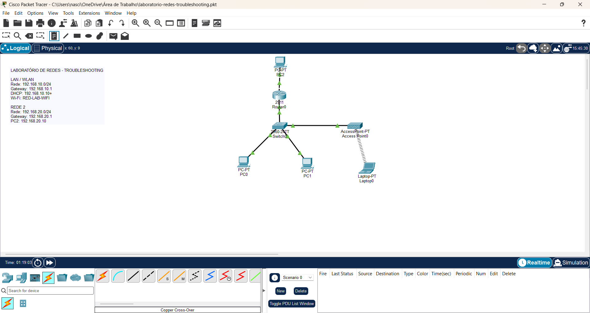
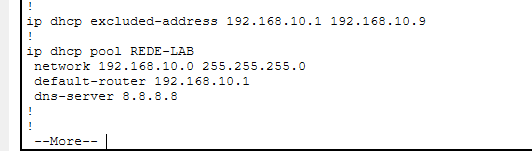
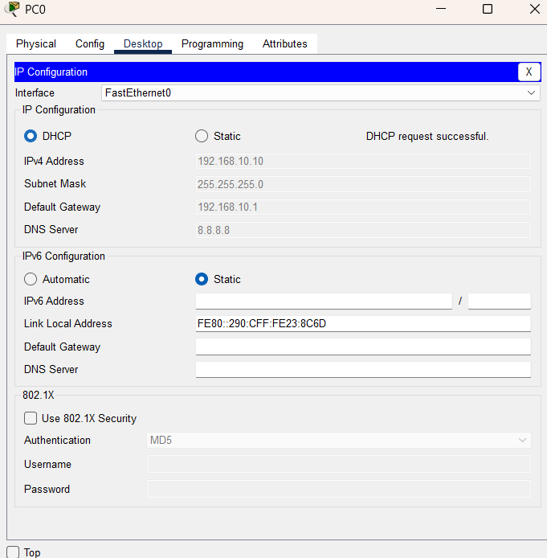
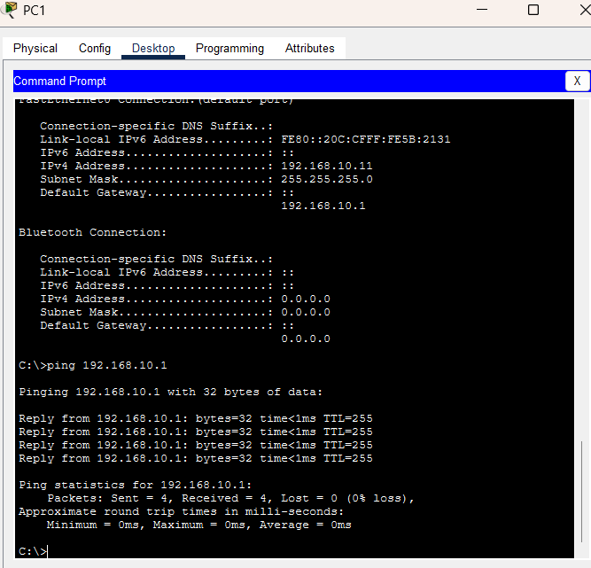
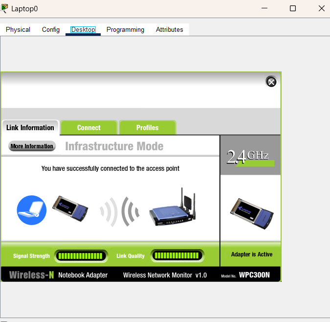
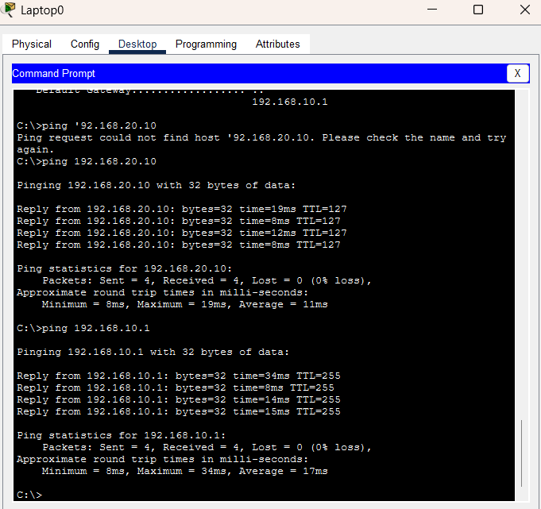

# Laboratório de Redes — Troubleshooting no Cisco Packet Tracer

Projeto prático desenvolvido no Cisco Packet Tracer com o objetivo de configurar uma pequena infraestrutura de rede e realizar troubleshooting de problemas de conectividade.

O laboratório envolve configuração de endereçamento IPv4, DHCP, rede wireless, roteamento entre duas redes e testes de conectividade utilizando ICMP.

## Topologia da Rede

A infraestrutura possui:

- 1 roteador Cisco 2911
- 1 switch Cisco 2960
- 1 Access Point
- 3 computadores
- 1 laptop conectado via Wi-Fi

Foram utilizadas duas redes:

| Rede | Endereço | Gateway |
|---|---|---|
| LAN/WLAN | `192.168.10.0/24` | `192.168.10.1` |
| Rede 2 | `192.168.20.0/24` | `192.168.20.1` |

## Configuração DHCP

O Router0 foi configurado como servidor DHCP para distribuir automaticamente endereços IP aos dispositivos da rede `192.168.10.0/24`.

Foram definidos:

- Pool DHCP: `REDE-LAB`
- Gateway padrão: `192.168.10.1`
- Servidor DNS: `8.8.8.8`
- Faixa inicial para clientes: `192.168.10.10`

O PC0 recebeu sua configuração de rede automaticamente através do DHCP.

## Testes na LAN

Após a configuração dos dispositivos, foram realizados testes de conectividade utilizando o comando `ping`.

O PC1 foi configurado na rede `192.168.10.0/24` e conseguiu alcançar o gateway `192.168.10.1` sem perda de pacotes.

## Configuração da rede Wi-Fi

Foi configurada uma WLAN utilizando um Access Point.

**SSID:** `RED-LAB-WIFI`

A rede utiliza autenticação WPA2-PSK.

Após a configuração do adaptador wireless e das credenciais da rede, o laptop conseguiu se associar corretamente ao Access Point.

## Comunicação entre redes

Além dos testes dentro da LAN, foi verificada a comunicação entre as redes `192.168.10.0/24` e `192.168.20.0/24`.

O laptop conectado via Wi-Fi conseguiu alcançar o dispositivo `192.168.20.10`, localizado na segunda rede.

O teste apresentou **0% de perda de pacotes**, confirmando o funcionamento da comunicação entre as duas redes.

## Troubleshooting realizado

Durante o laboratório foram identificados e corrigidos problemas relacionados a:

- configuração de endereçamento IPv4;
- atribuição de endereços via DHCP;
- gateway padrão;
- conectividade entre dispositivos;
- configuração do adaptador wireless;
- associação do laptop ao Access Point;
- autenticação WPA2;
- comunicação entre redes distintas.

Os comandos `ping` e `ipconfig` foram utilizados para verificar as configurações, testar a conectividade e auxiliar na identificação das falhas.

## Tecnologias e conceitos utilizados

- Cisco Packet Tracer
- IPv4
- DHCP
- WLAN
- WPA2-PSK
- Roteamento
- ICMP
- Gateway padrão
- Troubleshooting de redes

## Arquivo do laboratório

O arquivo `.pkt` disponível neste repositório contém a topologia completa e pode ser aberto utilizando o Cisco Packet Tracer.